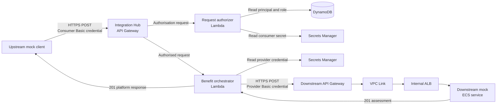
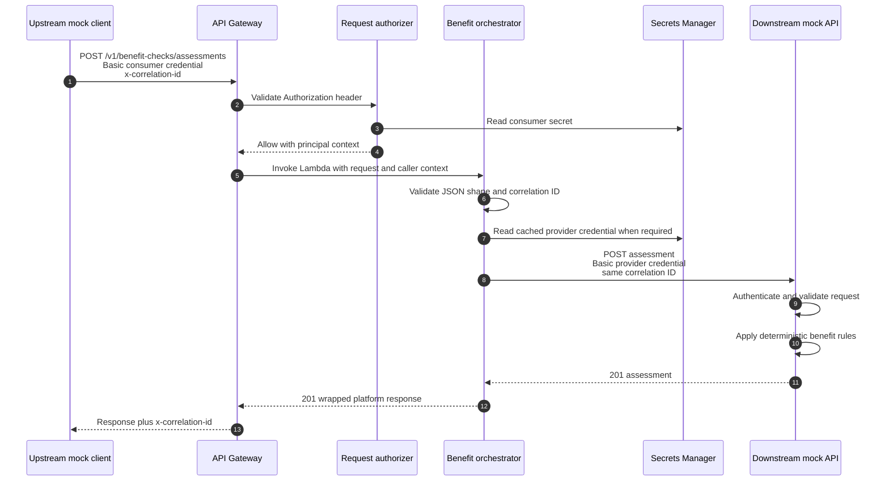

# Pilot mock API end-to-end flow

This document explains how the Integration Hub pilot demonstrates a complete
consumer-to-provider API journey. It covers the request path from the upstream
mock client, through the Integration Hub API Platform, to the downstream mock
benefit checker and back again.

> **Pilot status:** the current infrastructure is enabled only in development.
> The authentication methods and generated API Gateway URLs support the pilot
> and must be reviewed before production use.

## Repositories and responsibilities

| Repository | Responsibility |
| --- | --- |
| [`integration-hub-upstream-mock-api`](https://github.com/ministryofjustice/integration-hub-upstream-mock-api) | Demonstrates a consumer application. It builds a benefit-assessment request and calls Integration Hub with the consumer's credential. |
| [`integration-hub-api-platform`](https://github.com/ministryofjustice/integration-hub-api-platform) | Provides the stable client-facing contract. API Gateway authenticates the consumer and invokes the orchestration Lambda, which validates the request and calls the provider. |
| [`integration-hub-downstream-mock-api`](https://github.com/ministryofjustice/integration-hub-downstream-mock-api) | Simulates an independently operated provider. It authenticates Integration Hub, applies deterministic benefit rules and returns an assessment. |
| [`modernisation-platform-environments`](https://github.com/ministryofjustice/modernisation-platform-environments) | Defines the AWS infrastructure, deployment roles, authentication records, secrets, logging, throttling and alarms. |

## Architecture



There are two separate authentication boundaries:

1. The upstream consumer authenticates to Integration Hub. Its credential ends
   at the API Gateway authorizer and is never sent to the provider.
2. Integration Hub authenticates to the downstream provider with a different
   credential held in Secrets Manager. This credential is never returned to the
   consumer.

## Sequence



## Request lifecycle

### 1. The upstream mock creates the request

`IntegrationHubDemoRunner` creates a sample `BenefitAssessmentRequest` when
`INTEGRATION_HUB_DEMO_ENABLED=true`. `IntegrationHubClient` sends the request
directly to:

```text
POST /v1/benefit-checks/assessments
```

It adds:

- `Content-Type: application/json`
- the consumer's HTTP Basic credential
- an optional `x-correlation-id`

The client waits for the configured timeout and captures the response status,
correlation ID and JSON body.

### 2. API Gateway authenticates the consumer

The assessment route uses a Lambda request authorizer. The authorizer supports:

- HTTP Basic credentials for an interactive or demonstration user
- a pilot bearer-token format for a system principal

The authorizer looks up the principal and role in DynamoDB, reads the relevant
secret from Secrets Manager and uses a constant-time comparison for the secret
value. When authentication succeeds, it passes `principalId`, `roleName` and
`authType` to the orchestration Lambda. Invalid credentials are rejected before
the request reaches the orchestrator.

### 3. The orchestrator validates the public request

The benefit orchestrator:

- accepts only `POST /v1/benefit-checks/assessments`
- requires a JSON object containing the documented fields
- rejects missing fields and unknown fields
- requires `claimedBenefits` to be a non-empty array
- accepts a caller correlation ID only when it matches the permitted format

If the supplied correlation ID is absent or invalid, the orchestrator uses the
API Gateway request ID. It returns the chosen value in both the response body
and the `x-correlation-id` response header.

The OpenAPI contract is the source of truth for the public request and response
shape: [`openapi.yaml`](../openapi.yaml).

### 4. Integration Hub calls the downstream provider

The orchestrator reads its provider username and password from Secrets Manager.
It caches the credential for a short period, five minutes by default, and sends
the assessment to the downstream endpoint:

```text
POST /v1/benefit-checks/assessments
```

The outbound request contains:

- the provider-specific HTTP Basic credential
- the validated JSON payload
- the same `x-correlation-id`

The client credential used by the upstream application is not forwarded.

The orchestrator retries once in either of these situations:

- `401` or `403`: invalidate the cached provider credential, read it again and retry
- `429`, `500`, `502`, `503` or `504`: retry the provider request once

The pilot does not currently apply retry backoff or a circuit breaker.

### 5. The downstream mock evaluates the request

The downstream API runs as a Kotlin Spring Boot service in ECS/Fargate. Its
public API Gateway forwards traffic through a VPC link and internal Application
Load Balancer to the ECS task.

The application independently validates its Basic credential and request
fields. It then applies deterministic mock rules for income, savings, age,
children, disability and caring responsibilities. It returns one of:

- `ELIGIBLE`
- `REFER_FOR_REVIEW`
- `NOT_ELIGIBLE`

The rules exist only to make repeated demonstrations predictable. They are not
real benefit-entitlement policy.

### 6. Integration Hub returns a stable response

The orchestrator wraps a successful provider response with the platform request
ID and provider identifier:

```json
{
  "requestId": "pilot-demo-001",
  "provider": "mock-benefit-checker",
  "assessment": {
    "assessmentId": "6f0804b7-c34b-352d-9dc0-a98e2caadd1d",
    "decision": "ELIGIBLE",
    "matchedEntitlements": [
      {
        "code": "UC-HOUSING-SUPPORT",
        "title": "Universal Credit Housing Support",
        "reason": "Universal Credit claim with income at or below the mock threshold."
      }
    ],
    "riskFlags": [],
    "processedAt": "2026-08-24T12:00:00Z",
    "decisionSummary": "Eligible for 1 mocked entitlement(s)."
  }
}
```

This wrapper allows the provider implementation to change without changing how
the consumer identifies a platform request or provider.

## Example request

Use a non-production environment and obtain a pilot consumer credential through
the team responsible for that environment.

```bash
curl --request POST \
  "${INTEGRATION_HUB_API_BASE_URL}/v1/benefit-checks/assessments" \
  --user "${INTEGRATION_HUB_API_USERNAME}:${INTEGRATION_HUB_API_PASSWORD}" \
  --header 'Content-Type: application/json' \
  --header 'x-correlation-id: pilot-demo-001' \
  --data '{
    "firstName": "Alex",
    "lastName": "Morgan",
    "nino": "AA123456A",
    "dateOfBirth": "1991-08-25",
    "claimedBenefits": ["UNIVERSAL_CREDIT", "CHILD_BENEFIT"],
    "annualIncome": 21000,
    "savingsAmount": 1000,
    "housingCostsPerMonth": 950,
    "dependantChildren": 2,
    "disabledApplicant": true,
    "caringResponsibilities": false,
    "postcode": "SW1A 1AA"
  }'
```

Do not put real personal data in the pilot request.

## Running the upstream demonstration client

From `integration-hub-upstream-mock-api`:

```bash
cp .integration-hub-demo.env.example .integration-hub-demo.env
```

Add the non-production API endpoint and consumer credential to that local,
Git-ignored file, then run:

```bash
scripts/run-integration-hub-demo.sh
```

The script enables the one-shot demo runner and allows up to 30 seconds for the
end-to-end response. The application logs the platform status, request ID,
provider and response body. Stop the process after the demonstration completes.

## Error handling

The platform converts provider-specific failures into a stable public error
shape:

```json
{
  "requestId": "pilot-demo-001",
  "error": {
    "code": "provider_unavailable",
    "message": "The benefit checker is unavailable"
  }
}
```

| Situation | Client status | Platform error code |
| --- | ---: | --- |
| Invalid or incomplete public request | `400` | `invalid_request` |
| Provider rejects the request | `400` | `provider_rejected_request` |
| Provider credential remains invalid after retry | `502` | `provider_authentication_failed` |
| Provider cannot be reached | `502` | `provider_unavailable` |
| Provider returns another unexpected failure | `502` | `provider_error` |
| Provider rate limit remains after retry | `503` | `provider_rate_limited` |
| Provider times out | `504` | `provider_timeout` |
| Required Integration Hub configuration is missing | `500` | `service_misconfigured` |

Missing or invalid consumer credentials are rejected by the API Gateway
authorizer before the orchestrator runs.

## Configuration and secret ownership

| Setting or secret | Owner and location |
| --- | --- |
| Integration Hub API base URL | Supplied to the upstream client as `INTEGRATION_HUB_API_BASE_URL` |
| Consumer Basic username and password | Integration Hub API account, stored in Secrets Manager and referenced by the authorizer's DynamoDB principal record |
| System bearer token | Integration Hub API account, stored in Secrets Manager and referenced by the authorizer's DynamoDB principal record |
| Downstream API base URL | Orchestrator environment variable `DOWNSTREAM_BENEFIT_CHECKER_URL` |
| Provider Basic username and password | Generated in the downstream account and copied operationally into an Integration Hub-owned Secrets Manager secret |
| Provider request timeout | `DOWNSTREAM_TIMEOUT_SECONDS`, five seconds by default |
| Provider credential cache | `SECRET_CACHE_TTL_SECONDS`, 300 seconds by default |

No secret should be stored in source control, Helm values, Terraform state as a
live operational value or a local file that Git tracks.

## Deployment order

The dependencies require this order:

1. Apply the downstream mock infrastructure.
2. Deploy the downstream ECS application image and confirm its health endpoint.
3. Apply the Integration Hub benefit-checker API infrastructure.
4. Copy the downstream provider credential into the Integration Hub-owned secret.
5. Replace the generated consumer credential placeholders in Secrets Manager.
6. Deploy the authorizer and orchestrator Lambda packages from `integration-hub-api-platform`.
7. Configure the upstream client with the Integration Hub endpoint and its consumer credential.
8. Run the end-to-end demonstration and trace the correlation ID through the logs.

The infrastructure lives in these components in
`modernisation-platform-environments`:

- `terraform/environments/integration-hub/downstream-mock-api`
- `terraform/environments/integration-hub-api/benefit-checker-api`

Both components currently create the pilot service only in development.

## Observability and troubleshooting

Use the correlation ID to follow one request across the boundary.

| Symptom | First checks |
| --- | --- |
| Consumer receives an authentication failure | Check the consumer secret value, principal record, enabled flag and role record used by the authorizer. |
| Client receives `provider_authentication_failed` | Check that the Integration Hub copy of the provider credential matches the downstream secret. A rotated ECS secret also requires a new ECS deployment. |
| Client receives `provider_unavailable` or `provider_timeout` | Check the downstream API endpoint, ECS service health, ALB target health and the configured timeout. |
| Client receives `provider_rejected_request` | Compare the request with `openapi.yaml` and the downstream validation constraints. |
| Response has an unexpected correlation ID | Confirm the supplied value is no more than 128 characters and contains only letters, numbers, `.`, `_`, `:`, `/` or `-`. |
| API returns a bootstrap response or old behaviour | Confirm the application deployment workflow updated both Lambda functions after Terraform created them. |

Relevant logs and metrics include:

- Integration Hub API Gateway access logs
- request-authorizer Lambda logs
- benefit-orchestrator Lambda logs
- downstream API Gateway access logs
- downstream ECS application logs and container insights
- API Gateway 5xx and orchestrator-error alarms

The orchestrator logs request IDs, caller identities and provider statuses. It
does not log credentials or the assessment request fields.

## Pilot limitations

The implementation proves routing, boundary authentication, orchestration,
provider isolation, correlation and error normalisation. It is not a production
benefit-checking service. Before production use, the design would need at least:

- production-grade OAuth 2.0 or JWT-based machine authentication
- a stable custom domain instead of a generated API Gateway URL
- WAF controls and agreed traffic limits
- retry backoff, idempotency and circuit-breaking decisions
- production alert routing, support ownership and runbooks
- security, privacy, performance and resilience assurance
- configured pre-production and production environments
